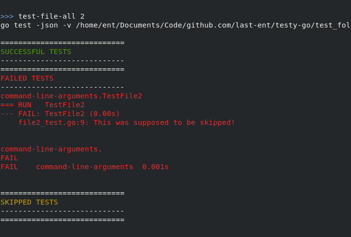

# Testy Go: A tool for easy testing!

[](https://goreportcard.com/report/github.com/last-ent/testy-go)

[](https://travis-ci.com/last-ent/testy-go)

----

## Table of Contents

* [How to Use](#how-to-use)
* [Commands](#commands)
  * [List Commands](#list-commands)
  * [Test Commands](#test-commands)
  * [Other Commands](#other-commands)
* [Demo](#demo)
  * [Commands used in Demo](#commands-used-in-demo)

 

## How to Use

In order to start the tool, you can run it from source or install it as follows:

```bash
# Expects Go to installed on the system.
$ go get github.com/last-ent/testy-go
```

In order to test a project/directory/package, start `testy-go` in one of two ways:

```bash
# You can start the tool after navigating to the expected folder
$ cd <path-to-top-directory>
$ testy-go

# You can also start the tool by providing `-dir` flag which is where you want the tool to test.
$ testy-go -dir=<path-to-top-directory>
```

## Commands

Broadly speaking, three types of commands are available:

### List Commands

These commands are used to list files & packages:

* `list`: List all packages and source files that can be tested.
* `list-dirs`: List all packages that can be tested.
* `list-files`: List all source files that can be tested.

### Test Commands

These commands are useful to test files & packages and also provide great levels of granularity

* `test`: Run all non-skippable tests under `dir`.
* `test-all`: Run all tests (including skippable) under `dir`.
* `test-dir`: Run all non-skippable tests under package (selected by index number) including nested sub-packages.
* `test-dir-all`: Run all tests (including skippable) under package (selected by index number) including nested sub-packages.
* `test-only-dir`: Run all tests immediately under package (selected by index number)
* `test-only-dir-all`: Run all tests (including skippable) immediately under package (selected by index number)
* `test-file`: Run all non-skippable tests in the file selected. (Selected by index number)
* `test-file-all`: Run all tests (including skippable) in the file selected. (Selected by index number)

> NOTE: The difference between `test-*-all` and `test-*` is that, `test-*-all` will run unskippable tests.
The convention in Go is to skip certain tests if `-short` flag is provided as a commandline argument.

### Other Commands

These commands are provide other arbitrary functionality
`q`, `quit`, `exit`: Quit or exit the application.

## Demo


### Commands used in Demo:

```bash
$ go run ./testy-go -dir=./test_folder # running from source
WELCOME TO TESTY GO! A TOOL FOR EASY TESTING.
CWD: <path>/github.com/last-ent/testy-go/test_folder

> list
# Listing all files & packages

> test
# Running all non-skippable tests

> list-files
# List all files

> test-file 2
# Output of tests mapped to index 2 when run with `-short` flag

> test-file-all 2
# Output of tests mapped to index 2 when run without `-short` flag
```
